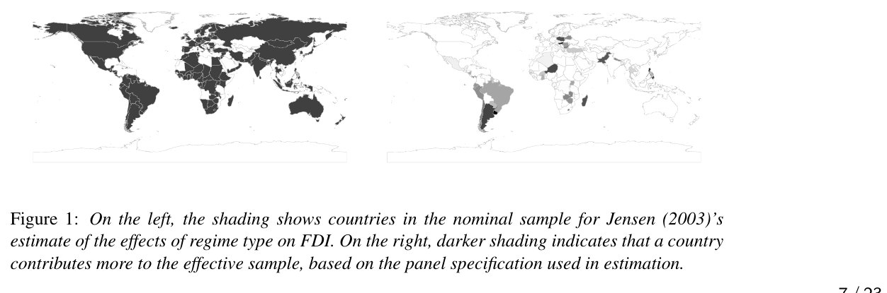

## Where we are going

Same identification strategy as Lecture 3. New question:

> **What can flexible estimation repair — and what can't it?**

Today:

- OR and IPW
- AIPW and double robustness
- High-dimensional $X$
- Naive ML plug-in failure
- Neyman orthogonality and cross-fitting
- DML

---

## Today's learning objectives

1. Ignorability + overlap: what estimation can't replace
2. Derive OR, IPW from identification
3. Double robustness = estimator property
4. High-dimensional $X$ ⇒ ML nuisance estimation
5. Naive ML failure: regularization + overfitting bias
6. Neyman orthogonality
7. Cross-fitting: why it's still needed
8. What DML fixes, and what it doesn't

---

## Start where we left off

Assume conditional ignorability:

$$
(Y(1),Y(0)) \perp D \mid X,
$$

with overlap:

$$
0 < P(D=1 \mid X) < 1.
$$

**This assumption does all the causal work.**

Today is about **estimating** a quantity that is already identified. No estimator creates identification that wasn't there.

---

## Why isn't more matching the answer?

Natural instinct: match on more covariates.

**Matching degrades with more covariates** (Samii et al. 2016) — bias, SE, and RMSE all worsen, even from irrelevant noise covariates.

Satisfying ignorability and satisfying a matching estimator are **not the same operation**.

---

## Regression has a subtler problem: the wrong estimand

$$
Y = \alpha + \theta_R D + X'\beta + \varepsilon
$$

Even with $X$ **sufficient for ignorability**, Aronow and Samii (2016):

$$
\hat\theta_R \xrightarrow{p} \frac{E[w_i\theta_i]}{E[w_i]}, \qquad w_i = \big(D_i - E[D_i\mid X_i]\big)^2
$$

where $\theta_i = Y_i(1)-Y_i(0)$ and $E[w_i\mid X_i] = \text{Var}[D_i\mid X_i]$.

**OLS weights by how much $D$ varies given $X$** — units near the assignment margin dominate.

---

## The Jensen (2003) example

Jensen (2003): effect of regime type on FDI, cross-national panel.

Aronow and Samii (2016): **nominal** sample vs. **effective** (variance-weighted) sample.

{fig-align="center" width="85%"}

::: {.callout-important}
### An invisible artifact of running regression with covariates — nobody chose this weighting.
:::

---

## Why this matters for today

$X$ sufficient for ignorability. Regression correctly specified. $\hat\theta_R$ still wrong under heterogeneity.

**A failure of the estimator, not of identification.**

Today: what makes an estimator target $E[Y(1)]-E[Y(0)]$ directly?

---

## Two ways to use the same identification result

$$
E[Y(1)] = E_X\big[E[Y \mid D=1, X]\big], \qquad
E[Y(0)] = E_X\big[E[Y \mid D=0, X]\big].
$$

1. **Outcome regression (OR):** model $E[Y \mid D, X]$, average over $X$.
2. **Inverse-probability weighting (IPW):** model $P(D=1\mid X)$, reweight.

Same estimand either way.

---

## Outcome regression

Let $\mu_1(X) = E[Y \mid D=1, X]$ and $\mu_0(X) = E[Y \mid D=0, X]$.

$$
\hat\tau_{OR} = \frac{1}{n}\sum_{i=1}^n \big(\hat\mu_1(X_i) - \hat\mu_0(X_i)\big)
$$

**Needs:** $\hat\mu_1, \hat\mu_0$ correct, or converging fast enough (next).

**Fails:** misspecification where treated or control units are sparse.

---

## Inverse-probability weighting

Let $\pi(X) = P(D=1 \mid X)$.

$$
\hat\tau_{IPW} = \frac{1}{n}\sum_{i=1}^n \left(\frac{D_i Y_i}{\hat\pi(X_i)} - \frac{(1-D_i) Y_i}{1-\hat\pi(X_i)}\right)
$$

**Needs:** $\hat\pi(X)$ correct, bounded away from 0 and 1.

**Fails:** near-0/1 $\hat\pi(X_i)$ ⇒ exploding weights.

---

## Augmented IPW: combine both

$$
\hat\tau_{AIPW} = \frac{1}{n}\sum_{i=1}^n \Bigg[
\hat\mu_1(X_i) - \hat\mu_0(X_i)
+ \frac{D_i\big(Y_i - \hat\mu_1(X_i)\big)}{\hat\pi(X_i)}
- \frac{(1-D_i)\big(Y_i - \hat\mu_0(X_i)\big)}{1-\hat\pi(X_i)}
\Bigg]
$$

OR **plus a bias-correction term**.

. . .

$$
\underbrace{\hat\mu_1(X_i) - \hat\mu_0(X_i)}_{\text{outcome regression}} \;+\; \underbrace{\frac{D_i(Y_i - \hat\mu_1(X_i))}{\hat\pi(X_i)} - \frac{(1-D_i)(Y_i - \hat\mu_0(X_i))}{1-\hat\pi(X_i)}}_{\text{bias correction}}
$$

- Treated residual, zeroed out for controls by $D_i$
- $\hat\pi(X_i)$ scales it up
- Mirror term for controls

---

## How this corrects mistakes

- $\hat\mu_1,\hat\mu_0$ **correct** ⇒ $E[Y_i - \hat{\mu}_1(X_i)] = 0$: correction is pure noise
- $\hat\mu_1,\hat\mu_0$ **wrong, $\hat\pi$ right:** reweighted residuals recover exactly the missing piece

---

## Proof

Condition on $X$ and define $E[D|X] = P(D=1|X) = \pi(X)$ and $E[Y|D=1,X] = \mu_1(X)$

$$
E\left[D\left(Y-\hat\mu_1(X)\right)\mid X\right].
$$

#### Step 1: Evaluate the conditional expectation

$$
\begin{aligned}
E\left[D\left(Y-\hat\mu_1(X)\right)\mid X\right]
&= E[DY\mid X]
   - E[D\hat\mu_1(X)\mid X] \\
&= \pi(X)\mu_1(X)
   - \pi(X)\hat\mu_1(X) \\
&= \pi(X)\left(\mu_1(X)-\hat\mu_1(X)\right).
\end{aligned}
$$

Expected treated residual = model error × probability of treatment.

---

## Step 2: Divide by the propensity score

$$
E\left[
\frac{D(Y-\hat\mu_1(X))}{\pi(X)}
\mid X
\right].
$$

$$
\begin{aligned}
E\left[
\frac{D(Y-\hat\mu_1(X))}{\pi(X)}
\mid X
\right]
&=
\frac{1}{\pi(X)}
E[D(Y-\hat\mu_1(X))\mid X] \\
&=
\frac{1}{\pi(X)}
\pi(X)(\mu_1(X)-\hat\mu_1(X)) \\
&=
\mu_1(X)-\hat\mu_1(X).
\end{aligned}
$$

Removes the $\pi(X)$ scaling.

---

## Step 3: Average over the distribution of $X$

$$
\begin{aligned}
E\left[
\frac{D(Y-\hat\mu_1(X))}{\pi(X)}
\right]
&=
E_X\left[
E\left[
\frac{D(Y-\hat\mu_1(X))}{\pi(X)}
\mid X
\right]
\right] \\
&=
E_X[\mu_1(X)-\hat\mu_1(X)].
\end{aligned}
$$

Equivalently,

$$
E\left[
\frac{D(Y-\hat\mu_1(X))}{\pi(X)}
\right]
=
E_X[\mu_1(X)]-E_X[\hat\mu_1(X)].
$$

---

## Step 4: Add the outcome-model prediction

$$
\begin{aligned}
E_X[\hat\mu_1(X)]
&+
E\left[
\frac{D(Y-\hat\mu_1(X))}{\pi(X)}
\right] \\
&=
E_X[\hat\mu_1(X)]
+
E_X[\mu_1(X)-\hat\mu_1(X)] \\
&=
E_X[\mu_1(X)].
\end{aligned}
$$

$\hat\mu_1(X)$ cancels.

---

## Step 5: Connect $\mu_1(X)$ to POs

$$
\mu_1(X)=E[Y\mid D=1,X].
$$

Consistency:

$$
Y=Y(1) \qquad \text{when } D=1, ~~\text{so}~~~\mu_1(X)
=
E[Y(1)\mid D=1,X].
$$

Under conditional ignorability,

$$
Y(1)\perp D\mid X,
$$

which implies

$$
E[Y(1)\mid D=1,X]
=
E[Y(1)\mid X].
$$

Therefore,

$$
\mu_1(X)=E[Y(1)\mid X].
$$

---

## Step 6: Average over $X$

$$
\begin{aligned}
E_X[\mu_1(X)]
&=
E_X\left[E[Y(1)\mid X]\right] \\
&=
E[Y(1)].
\end{aligned}
$$

$$
\boxed{
\begin{aligned}
E_X[\hat\mu_1(X)]
&+
E\left[
\frac{D(Y-\hat\mu_1(X))}{\pi(X)}
\right] \\
&=
E_X[\mu_1(X)] \\
&=
E_X\left[E[Y(1)\mid X]\right] \\
&=
E[Y(1)].
\end{aligned}
}
$$

---

## Double robustness

::: {.callout-important}
### AIPW is consistent if *either* $\hat\mu_d(X)$ *or* $\hat\pi(X)$ is correctly specified — not necessarily both.
:::

$$
\boxed{
\text{Correct } \mu(X) \ \text{ OR } \ \text{Correct } \pi(X)
\ \Longrightarrow\
\hat\tau_{AIPW} \xrightarrow{p} \tau
}
$$

Two independent chances to get it right.

**Estimation statement, conditional on ignorability — not a second identification strategy.**

---

## Back to the motivating question

Recall: $\hat\theta_R \xrightarrow{p} E[w_i\theta_i]/E[w_i]$, $w_i=\text{Var}[D_i\mid X_i]$.

**$\hat\tau_{AIPW}$ avoids this** — averages $\hat\mu_1(X)-\hat\mu_0(X)$ over $X$ directly: $E_X[\mu_1(X)] = E[Y(1)]$, no implicit reweighting.

::: {.callout-important}
### A second reason AIPW earns its complexity, beyond double robustness: it targets the ATE by construction.
:::

---

## Where high-dimensional $X$ enters

Lecture 2: adjustment sets are often large.

Parametric $\hat\mu(X)$, $\hat\pi(X)$ misspecified exactly where ignorability is most defensible.

Natural fix: flexible ML.

**New problem — statistical, not causal.**

---

## Why naive ML plug-in fails: overview

Plug ML $\hat\mu(X)$, $\hat\pi(X)$ into $\hat\tau_{OR}$, $\hat\tau_{IPW}$, or AIPW; fit and evaluate on the **same data**.

1. **Regularization/overfitting bias.**
2. **Slow convergence:** rate $n^{-1/4}$, not $n^{-1/2}$.

---

## Overfitting bias, concretely

Fit $\hat\mu(X)$ on the full sample; evaluate $Y_i - \hat\mu(X_i)$ on the **same units**.

Residuals shrink toward zero — the model memorized $Y_i$.

**Bias that does not vanish as $n \to \infty$.**

---

## Slow convergence, concretely

Parametric: $\hat\mu(X) - \mu(X) = O_p(n^{-1/2})$.

ML: $\hat\mu(X) - \mu(X) = O_p(n^{-1/4})$ (or slower).

$$
O_p(n^{-1/4}) \times O_p(n^{-1/4}) = O_p(n^{-1/2})
$$

**only if the score is orthogonal.**

---

## What does it mean for a *function* to converge?

$\mu(X)$ is a function — "close" isn't one number.

$$
\underbrace{Y - \hat\mu(X)}_{\text{residual}} = \underbrace{Y - \mu(X)}_{\text{irreducible noise } \varepsilon} + \underbrace{\mu(X) - \hat\mu(X)}_{\text{estimation error}}
$$

- $\varepsilon$: never shrinks
- $\mu(X) - \hat\mu(X)$: shrinks with data — this is "convergence"

::: {.callout-important}
### Small residuals ≠ $\hat\mu$ close to $\mu$.
:::

---

## Turning a function-to-function gap into one number

$$
\|\hat\mu - \mu\|^2 = E_X\big[(\hat\mu(X) - \mu(X))^2\big]
$$

Average squared gap, over the distribution of $X$.

"Converges fast enough" = does $\|\hat\mu - \mu\|^2$ shrink, and how fast?

---

## Why flexible estimators converge more slowly

. . .

**Parametric:** few coefficients — every observation sharpens all of them. Error shrinks proportional to $1/\sqrt{n}$.

. . .

**ML:** also guards against overfitting. Error shrinks much more slowly, often close to $1/n^{1/4}$.

. . .

| Sample size | Error, parametric ($\propto n^{-1/2}$) | Error, ML ($\propto n^{-1/4}$) |
|---|---|---|
| 100 | 0.10 | 0.32 |
| 1,600 (16×) | 0.025 | 0.16 |
| 25,600 (256×) | 0.006 | 0.08 |

---

## What we actually need

An estimator of $\tau$ that:

1. tolerates $n^{-1/4}$-rate nuisance estimation, and
2. still converges at rate $n^{-1/2}$.

Two ingredients:

- **Neyman orthogonality**
- **Cross-fitting**

---

## Neyman orthogonality: the idea

$\psi(W; \tau, \eta)$ (here $\eta = (\mu_1,\mu_0,\pi)$) is **Neyman orthogonal** if

$$
\left.\frac{\partial}{\partial \eta}\, E\big[\psi(W;\tau,\eta)\big]\right|_{\eta=\eta_0} = 0.
$$

Small $\hat\eta$ errors move $E[\psi]$ only at **second order**.

AIPW: built doubly robust — orthogonality's finite-sample cousin.

---

## Why the naive score fails: a concrete calculation

$\psi(W;\theta,\mu) = \mu_1(X)-\mu_0(X)-\theta$.

$$
\hat\theta - \theta_0 \;\approx\; \underbrace{\partial_\mu E[\psi(W;\theta_0,\mu_0)]}_{\text{sensitivity to } \mu\text{-error}}\,[\hat\mu-\mu_0]
\;=\; E\big[(\hat\mu_1-\mu_1)(X)\big] - E\big[(\hat\mu_0-\mu_0)(X)\big]
$$

**Derivative = the identity.** Bias in $\hat\mu_1,\hat\mu_0$ passes straight through, undiminished.

---

## Checking the AIPW score directly

$$
\partial_{\mu_1} E[\psi]\,[\tilde\mu_1] = E\left[\tilde\mu_1(X)\left(1-\frac{D}{\pi(X)}\right)\right]
= E\left[\tilde\mu_1(X)\left(1-\frac{E[D\mid X]}{\pi(X)}\right)\right]
$$

**If $\pi(X)$ correct**, $E[D\mid X]=\pi(X)$, so this is $1-1=0$ — for *every* $\tilde\mu_1$.

::: {.callout-important}
### Neyman orthogonality, verified: wiggling $\hat\mu_1$ doesn't move $E[\psi]$, to first order.
:::

Symmetric result for perturbing $\pi$ ⇒ **double robustness**, derived.

---

## Orthogonality does the heavy lifting

$$
O_p(n^{-1/4}) \times O_p(n^{-1/4}) = O_p(n^{-1/2}).
$$

Two slow nuisance estimators combine into one fast causal estimator — **if the score is orthogonal.**

**Non-orthogonal score:** no such protection.

---

## Orthogonality is not enough on its own

Handles the *rate* problem in population.

Not **overfitting:** same-data $\hat\eta$ breaks the second-order bound.

Need: independence between fitting data and evaluation data.

That is cross-fitting.

---

## Cross-fitting

1. Split into $K$ folds (e.g., $K=5$).
2. Fit $\hat\mu_1, \hat\mu_0, \hat\pi$ on the other $K-1$ folds.
3. Evaluate $\psi$ on the held-out fold.
4. Average to get $\hat\tau$.

Every unit is evaluated with nuisances it didn't help fit.

---

## Cross-fitting removes the overfitting bias

::: {.callout-important}
### A structural requirement for valid inference with ML nuisance estimators — not a robustness check.
:::

Without it: overfit residuals ⇒ biased score ⇒ invalid SEs.

With it: $\hat\tau$ is $\sqrt{n}$-consistent, asymptotically normal, valid CIs.

---

## Cross-fitted AIPW, formalized

$\hat\pi_{-k}, \hat\mu_{1,-k}, \hat\mu_{0,-k}$: nuisance fits trained on every fold **except** $k$.

$$
\hat\psi_i = \hat\mu_{1,-k}(X_i)-\hat\mu_{0,-k}(X_i) + \frac{D_i\big(Y_i-\hat\mu_{1,-k}(X_i)\big)}{\hat\pi_{-k}(X_i)} - \frac{(1-D_i)\big(Y_i-\hat\mu_{0,-k}(X_i)\big)}{1-\hat\pi_{-k}(X_i)}
$$

$$
\hat\theta_{DML} = \frac{1}{N}\sum_{i=1}^N \hat\psi_i.
$$

$$
\widehat{\mathrm{Var}}(\hat\theta_{DML}) = \frac{1}{N^2}\sum_{i=1}^N \big(\hat\psi_i - \hat\theta_{DML}\big)^2
$$

---

## When does DML work? The formal statement

$$
\hat\theta_{DML} - \theta_0 = \frac{1}{N}\sum_{i=1}^N \phi_0(W_i) + R_N, \qquad R_N = O_p\big(\|\hat\mu-\mu_0\|_2\,\|\hat\pi-\pi_0\|_2\big)
$$

**Sufficient rate condition:**

$$
\|\hat\mu-\mu_0\|_2\,\|\hat\pi-\pi_0\|_2 = o_p(N^{-1/2})
$$

**Rule of thumb:** both nuisances $o_p(N^{-1/4})$ ⇒ asymptotic normality.

**Caution:** weak overlap ⇒ $R_N$ need not be small, even with cross-fitting.

---

## Double/debiased machine learning (DML)

$$
\boxed{
\text{DML} = \text{Orthogonal (AIPW-type) score} + \text{Flexible ML nuisance estimators} + \text{Cross-fitting}
}
$$

Random forests, lasso, boosting, neural nets for $\hat\mu(X)$ and $\hat\pi(X)$ **without** sacrificing $\sqrt{n}$-consistency.

**Estimation** technology — not "is $X$ right?"

---

## AIPW is efficient, not just consistent

Semiparametric efficiency bound: smallest variance among regular, asymptotically linear estimators. Attained by the **efficient influence function (EIF)**.

**AIPW score = the EIF for the ATE** under unconfoundedness.

::: {.callout-important}
### You cannot asymptotically beat AIPW/DML's variance without strengthening the assumptions.
:::

---

## What DML repairs

- Misspecification bias from rigid parametric models
- Hand-specifying functional form in high-dimensional $X$
- The flexibility-vs.-valid-inference tension

---

## What DML does not repair

::: {.callout-important}
### DML assumes conditional ignorability and overlap. It does not test, weaken, or substitute for them.
:::

- Omitted confounder ⇒ **precisely wrong** number, **tight** CI
- Weak overlap still destabilizes the estimator
- Good fit to $X$ ≠ sufficient adjustment set

$$
\boxed{
\text{Flexible nuisance estimation} \not\Rightarrow \text{Conditional ignorability}
}
$$

---

## A special case: partially linear regression via FWL

Assume a **constant treatment effect**:

$$
Y = \theta_0 D + g_0(X) + \varepsilon
$$

Frisch–Waugh–Lovell / partialling out:

1. ML for $\ell_0(X)=E[Y\mid X]$, $r_0(X)=E[D\mid X]$.
2. Residuals $\tilde Y = Y-\hat\ell(X)$, $\tilde D = D-\hat r(X)$.
3. Regress $\tilde Y$ on $\tilde D$.

The underlying score, $\psi(W;\theta,\eta) = \big[(Y-\eta_Y(X))-\theta(D-\eta_D(X))\big](D-\eta_D(X))$, is Neyman orthogonal (Ahrens et al. 2026) — same recipe, linear-in-$D$ model.

---

## Is PLR-DML "better" than AIPW-DML?

- **Constant effects:** same $\theta_0$; PLR-DML typically **more efficient**.
- **Heterogeneous effects:** PLR-DML **not consistent for the ATE** — same Aronow-Samii weighting, now via ML.

::: {.callout-important}
### Orthogonality and cross-fitting fix estimation. They don't fix the estimand problem from a constant-effect specification.
:::

**Default to AIPW unless you can defend homogeneous effects.**

---

## Diagnosing a DML analysis: questions to ask

1. Is $X$ defended on substantive grounds (Lecture 2), not just "kitchen sink"?
2. Was cross-fitting used, and how many folds?
3. Any overlap check — trimming, diagnostics?
4. Which ML method(s), and does it matter?
5. Does a simpler parametric AIPW give a similar answer?

---

## In-class exercise

Three hypothetical DML analyses of the same comparison:

### Analysis A
Rich $X$, defended; cross-fitting used; tight CI similar to parametric AIPW.

### Analysis B
Rich $X$, kitchen sink, no defense; cross-fitting used; tight CI very different from simpler estimates.

### Analysis C
Rich $X$, defended; no cross-fitting; extremely tight CI.

For each: what's demonstrated? What's uncertain? Identification, design, or estimation?

---

## What PS1 will ask you to do

- Same selection-on-observables design as Lecture 3
- Re-estimate with AIPW: flexible nuisance models, cross-fitting
- Compare to Lecture 3's matching/weighting estimate
- Did **estimation** flexibility change the answer, or something else?

**The endpoint is deciding why, not just computing.**

---

## What you should be able to do after today

- Write down OR, IPW, AIPW; connect each to conditional ignorability
- Explain double robustness precisely
- Explain why high-dimensional $X$ motivates ML nuisance estimation
- Diagnose naive ML bias: overfitting + slow convergence
- State Neyman orthogonality and what it buys you
- Explain why cross-fitting is still needed
- Distinguish what DML fixes (estimation) from what it can't (identification)

---

## What comes next

Selection-on-observables, end to end: identification, conditioning, construction, estimation.

Next: when observables aren't enough.

- Instrumental variables
- Regression discontinuity
- Difference-in-differences

> **What identifying variation can we exploit when conditional ignorability isn't credible?**

---

## This week's readings, in brief

- **Chernozhukov et al. (2018)** — named DML: the general recipe
- **Athey, Imbens, and Wager (2018)** — a contrasting sparse-linear strategy
- **Kennedy (2024)** — the efficiency theory underneath AIPW/DML
- **Ahrens et al. (2026)** — a practitioner's field guide

---

## Chernozhukov et al. (2018): the origin of the recipe

Coined "double/debiased machine learning": orthogonal scores + cross-fitting — exactly today's recipe.

Formalizes two failure modes:

- **regularization bias** — first-order sensitivity to nuisance error
- **overfitting bias** — dependence between $\hat\eta$ and the evaluation data

**DML1** solves per fold, averages $\hat\theta_k$. **DML2** pools the score, solves once — generally more stable.

---

## Chernozhukov et al.: a menu of canonical applications

- **Partially linear regression** ($Y = \theta_0 D + g_0(X) + \varepsilon$)
- **Partially linear IV**
- **ATE/ATT under unconfoundedness** (interactive regression model — our AIPW setting)
- **LATE**, instrumental variables

**Takeaway:** the same recipe applies far beyond selection-on-observables.

---

## Chernozhukov et al.: the 401(k) example

401(k) *eligibility* on net financial assets (SIPP data; Chernozhukov and Hansen 2004):

- **No controls:** ATE $\approx \$19{,}559$ (SE $1{,}413$)
- **DML-controlled:** ATE $\approx \$8{,}200$–$9{,}200$, essentially **the same across six ML learners**

::: {.callout-important}
### Agreement across learners is a diagnostic. Large disagreement is a warning sign.
:::

---

## Athey, Imbens, and Wager (2018): a different bet

Same motivation: unconfoundedness more plausible with rich $X$, but rich $X$ breaks standard estimation.

Question: in a **high-dimensional linear** outcome model, do we need $\hat\pi(X)$ at all?

**Answer: no.** Sparse linear $\mu_d(X)$ ⇒ $\sqrt{n}$-consistent inference from **overlap alone**.

---

## Athey, Imbens, and Wager: approximate residual balancing

1. Regularized (lasso/elastic net) outcome model, per arm.
2. Reweight **residuals** to balance covariates (Zubizarreta 2015) — not to fit a propensity model.

Corrects regularization shrinkage bias **without estimating $\pi(X)$**.

**Cost:** commits to linearity/sparsity in $\mu(X)$.

---

## Kennedy (2024): the theory underneath AIPW

The AIPW formula, **derived** — not asserted.

$$
\psi(\hat P) - \psi(P) = -\underbrace{\int \phi(z;\hat P)\,dP(z)}_{\text{first-order bias}} + R_2(\hat P, P).
$$

Naive plug-in inherits that bias directly. Fix — subtract it — gives the **one-step estimator**:

$$
\hat\psi = \psi(\hat P) + P_n\{\phi(Z;\hat P)\}.
$$

For the ATE: exactly our AIPW score.

---

## Kennedy: naming the two failure modes precisely

$$
\hat\psi - \psi = \underbrace{(P_n - P)\{\hat\phi - \phi\}}_{T_1 \text{: empirical process term}} + \underbrace{R_2(\hat P, P)}_{T_2 \text{: remainder/regularization-bias term}}.
$$

- $T_1 \to 0$: sample splitting — cross-fitting's job
- $T_2 \to 0$: orthogonality + convergence rates

Generalizes beyond ATEs — LATEs, stochastic interventions, missing data.

---

## Ahrens et al. (2026): the practitioner's field guide

Dube et al. (2020), MTurk monopsony: text-based task features as high-dimensional $X$.

$$
m_{naive}(W;\theta,\eta) = (Y - g(X) - \theta D)D, \qquad
m_{PLM}(W;\theta,\eta) = \big[(Y-\ell(X)) - \theta(D-r(X))\big](D - r(X)).
$$

Both **identify** $\theta_0$. Only $m_{PLM}$ is Neyman orthogonal.

---

## Ahrens et al.: practical recommendations for PS1

- **Folds:** $K=5$ or $10$
- **Repeat cross-fitting** across splits; report the spread
- **Try multiple learners**; large disagreement is a warning sign

::: {.callout-important}
### Common ML defaults don't automatically satisfy DML's convergence-rate requirements.
:::

Random forests, deep trees: can fail to converge fast enough. "We used a random forest" ≠ a valid DML analysis.

---

## Core readings

- Chernozhukov, V., D. Chetverikov, M. Demirer, E. Duflo, C. Hansen, W. Newey, and J. Robins. 2018. "Double/Debiased Machine Learning for Treatment and Structural Parameters." *The Econometrics Journal* 21(1): C1–C68.
- Kennedy, E. H. 2024. "Semiparametric Doubly Robust Targeted Double Machine Learning: A Review." *Statistics Surveys* (or working paper version).

### Recommended

- Glynn, A. N. and K. M. Quinn. 2010. "An Introduction to the Augmented Inverse Propensity Weighted Estimator." *Political Analysis* 18(1): 36–56.
- Athey, S., G. W. Imbens, and S. Wager. 2018. "Approximate Residual Balancing: De-Biased Inference of Average Treatment Effects in High Dimensions." *Journal of the Royal Statistical Society: Series B* 80(4): 597–623.
- Ahrens, A., C. B. Hansen, M. E. Schaffer, and T. Wiemann. 2026. "Introduction to Double Machine Learning."

---

## The central lesson

::: {.callout-important}
### DML solves a statistical problem: using flexible estimators without breaking $\sqrt{n}$-inference.
:::

Not a solution to the identification problem from Lectures 1–2.

$$
\boxed{
\text{Cross-fitted, orthogonal, ML-based estimation}
\not\Rightarrow
\text{conditional ignorability holds}
}
$$
