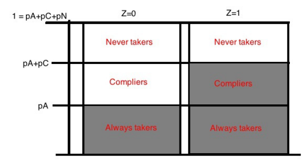

## Where we are going

Lectures 3–4 covered selection on observables: identification, conditioning, construction, estimation.

. . .

Every one of those tools shares a single load-bearing assumption: we have measured enough of $X$ to make $D$ as good as random.

. . .

> What do we do when we don't believe that?

Today's answer is instrumental variables — a genuinely different identification argument, not a fancier estimator.

---

## Today's plan

1. Two-slide recap: what DML fixed, and what it left alone
2. The textbook, constant-effects IV model — and exactly what it's assuming
3. Potential-outcomes IV: LATE and compliers
4. Characterizing compliers: Abadie's $\kappa$, worked in R
5. What 2SLS estimates once effects are heterogeneous
6. Weak instruments
7. Testing IV validity, and — separately — living with what you can't test

We'll build each piece from a question, not hand you the formula first.

---

## Recap: the assumption Lectures 1–4 ran on

$$
(Y(1),Y(0)) \perp D \mid X, \qquad 0 < P(D=1\mid X) < 1.
$$

. . .

Everything in Lecture 4 — AIPW, double robustness, Neyman orthogonality, cross-fitting — sits on top of this line. None of it questions the line.

. . .

DML answers a narrower question: *given* that this assumption holds, how do we estimate well with flexible, high-dimensional $X$?

---

## Recap: the central lesson

$$
\boxed{
\text{Cross-fitted, orthogonal, ML-based estimation}
\not\Rightarrow
\text{conditional ignorability holds}
}
$$

. . .

If $D$ and $Y$ share a confounder that isn't in $X$, DML doesn't fail loudly. It returns a precise, confident, wrong number.

. . .

So: what do we do when we don't believe we've measured everything that confounds $D$ and $Y$?

---

## A confounder that stays hidden

Take the classic case: schooling and wages, confounded by ability.

. . .

Test scores, family background, school quality — plausible proxies, all of them. None of them *is* ability.

. . .

Adding more covariates doesn't rescue us here. It's not a specification problem. If the confounder isn't in $X$, no amount of $X$ closes it off — DML included.

. . .

Selection on observables isn't an option in this setting. Not because the estimator is bad — because the identifying assumption isn't credible. We need a different source of identifying variation altogether.

---

## The instrumental-variables idea

Find a variable $Z$ that satisfies three things.

. . .

**1. Relevance.** $Z$ moves $D$.

. . .

**2. Independence.** $Z$ is as good as randomly assigned.

. . .

**3. Exclusion.** $Z$ affects $Y$ only through $D$.

---

## What having such a $Z$ buys you

If $Z$ satisfies all three, we can use the variation in $D$ that $Z$ drives — and that variation is not confounded, because $Z$ itself is not.

. . .

Notice what this is *not*: we are not conditioning our way out of confounding, the way Lectures 1–4 tried to. We are substituting a clean source of variation in $D$ for the murky, possibly-confounded variation we were stuck with before.

. . .

That substitution is the whole idea. Everything else today is about what it costs and what it buys.

---

## The textbook IV model

Start where most people start — the model you'd see in a first-year econometrics course:

$$
Y_i = \alpha + \theta D_i + \varepsilon_i, \qquad D_i = \pi_0 + \pi_1 Z_i + \nu_i
$$

. . .

$$
\text{Cov}(Z_i,\varepsilon_i)=0, \qquad \pi_1 \neq 0
$$

. . .

and — read past it once, because we're about to stop reading past it — $\theta_i = \theta$ for every unit $i$.

---

## The 2SLS estimator

Under that model,

$$
\hat\theta_{2SLS} = \frac{\text{Cov}(Z,Y)}{\text{Cov}(Z,D)}
$$

. . .

Clean formula. One coefficient. Feels like it should just work.

. . .

Here's the question for the next several slides: what is the constant-effects line — $\theta_i=\theta$ for everyone — actually buying you? What breaks if it's false?

---

## Suppose we don't assume constant effects

Let $\tau_i = Y_i(1)-Y_i(0)$ — possibly different for every unit.

. . .

Split the population by how each unit's treatment responds to $Z$. Four logical types:

. . .

- **complier** — takes $D=1$ only if $Z=1$
- **defier** — takes $D=1$ only if $Z=0$
- **always-taker** — takes $D=1$ regardless of $Z$
- **never-taker** — takes $D=0$ regardless of $Z$

. . .

Don't assume any of these types is empty yet. We're being deliberately permissive.

---

## Building the reduced form, one type at a time

$$
ITT_Y \equiv E[Y_i\mid Z_i=1]-E[Y_i\mid Z_i=0]
$$

. . .

Always-takers and never-takers: their treatment status doesn't move with $Z$ at all, so — under exclusion — their contribution to this contrast is zero. (We'll prove this properly in a few slides; take it on faith for now.)

. . .

Compliers and defiers are the only types left standing:

$$
ITT_Y = \pi_c\,E[\tau\mid c] \;-\; \pi_d\,E[\tau\mid d]
$$

. . .

The minus sign on the defier term isn't decoration — defiers move *opposite* the instrument, so their contribution flips sign.

---

## The first stage, same logic

$$
ITT_D \equiv E[D_i\mid Z_i=1]-E[D_i\mid Z_i=0] = \pi_c - \pi_d
$$

. . .

Compliers add a unit of $D$ when $Z$ turns on. Defiers subtract one. Always- and never-takers contribute nothing, same as before.

. . .

Now put the two together — this ratio is what 2SLS actually computes:

$$
\hat\theta_{2SLS} \;=\; \frac{ITT_Y}{ITT_D} \;=\; \frac{\pi_c E[\tau\mid c] - \pi_d E[\tau\mid d]}{\pi_c - \pi_d}
$$

---

## Now bring back constant effects

If $\tau_i = \theta$ for *every* unit — compliers and defiers alike — then $E[\tau\mid c] = E[\tau\mid d] = \theta$.

. . .

$$
\frac{ITT_Y}{ITT_D} = \frac{\theta(\pi_c-\pi_d)}{\pi_c-\pi_d} = \theta
$$

. . .

for **any** value of $\pi_d$. The defier share cancels out of the ratio completely.

. . .

::: {.callout-note}
Under constant effects, it doesn't matter whether defiers exist. Monotonicity is not needed. This is the whole reason the textbook model never mentions it.
:::

---

## What happens once effects differ

Drop constant effects, keep some defiers around, and give compliers and defiers genuinely different effects.

. . .

Say $\pi_c=0.4$ with $E[\tau\mid c]=2$, and a small defier share $\pi_d=0.1$ with $E[\tau\mid d]=-8$.

. . .

We'll compute the Wald ratio in R rather than by hand — same formula, just let the arithmetic run.

---

## In R: setting it up

```{r}
#| eval: false
# Population shares and subgroup effects
pi_c <- 0.4; tau_c <- 2
pi_d <- 0.1; tau_d <- -8

itt_y <- pi_c * tau_c - pi_d * tau_d
itt_d <- pi_c - pi_d
wald  <- itt_y / itt_d
```

. . .

```{r}
#| eval: false
c(itt_y = itt_y, itt_d = itt_d, wald = wald)
#>  itt_y  itt_d   wald
#>    1.6    0.3   5.33
```

---

## Read that number again

The complier effect is 2. The defier effect is $-8$. The Wald estimate is **5.33**.

. . .

5.33 is not between $-8$ and $2$. It is not a weighted average of anything real in this population — because a weighted average of two numbers, with weights that sum to something between $0$ and $1$, cannot land outside the interval between them.

. . .

The defier weight in this ratio is effectively negative. That's what lets the estimate escape the range of the true subgroup effects entirely.

. . .

`toy_data_iv.R`, section 1, simulates this population directly at $N=100{,}000$ and confirms the same number — then drops the defiers and confirms the Wald estimator recovers $\tau_c=2$ exactly once they're gone.

---

## So heterogeneity isn't the problem, exactly

Heterogeneity alone doesn't break identification. What breaks it is heterogeneity *combined with* defiers.

. . .

Rule out defiers — assume $D_i(1)\geq D_i(0)$ for everyone, "monotonicity" — and the cancellation from two slides ago goes through again, this time without needing constant effects at all.

. . .

::: {.callout-note}
Constant effects makes an estimator's target well defined for free. Give it up, and you buy the interpretability back with a different assumption — monotonicity, not exclusion, not independence.
:::

---

## The parallel to Lecture 4

This is the same shape of problem as $\hat\theta_R$ under OLS.

. . .

OLS needed full covariate interactions to avoid Aronow and Samii's variance-weighting result. The Wald estimator needs monotonicity to avoid this defier problem.

. . .

Same lesson, different estimator: a convenient constant-effects assumption is quietly doing identification work. Once you drop it, something else has to do that work instead.

---

## A cleaner formulation

The type-by-type bookkeeping we just did — compliers, defiers, always-takers, never-takers — is really a potential-outcomes argument wearing a textbook-regression costume.

. . .

Angrist, Imbens & Rubin (1996) build it properly, with no constant-effects assumption anywhere. Let's redo the setup their way.

---

## Potential-outcomes IV: the setup

Binary instrument $Z_i\in\{0,1\}$, binary treatment $D_i\in\{0,1\}$.

. . .

**Potential treatments:** $D_i(1)$, $D_i(0)$ — the treatment $i$ *would* take under each value of $Z$, only one of which we ever observe.

. . .

**Potential outcomes, in general:** $Y_i(z,d)$ — indexed by both the instrument and the treatment, because in principle $Z$ could matter for reasons other than moving $D$.

. . .

Observed values: $D_i = D_i(Z_i)$, and $Y_i = Y_i\big(Z_i, D_i(Z_i)\big)$.

---

## The four assumptions, one at a time

**Independence.**

$$
\big(Y_i(1),Y_i(0),D_i(1),D_i(0)\big) \perp Z_i
$$

$Z$ carries no information about who a unit is, causally. This is the "as good as random" condition, and it is what a randomized encouragement design or a natural experiment is supposed to buy you.

---

## The four assumptions, one at a time

**Exclusion.**

$$
Y_i(z,d) = Y_i(d) \quad \text{for all } z
$$

The two-argument $Y_i(z,d)$ collapses to a one-argument $Y_i(d)$. $Z$ has no path to $Y$ except through $D$. This is the assumption that cannot be tested directly — it has to be argued.

---

## The four assumptions, one at a time

**Relevance.**

$$
E[D_i(1)] \neq E[D_i(0)]
$$

$Z$ actually moves $D$ on average. Directly testable — it's the first stage.

. . .

**Monotonicity.**

$$
D_i(1) \geq D_i(0) \quad \text{for all } i
$$

No defiers. This is new — the constant-effects model never needed it, for the reason we just derived.

---

## Naming the types again, properly

Type is defined by the pair $(D_i(1),D_i(0))$ — unobserved, since we only ever see $D_i(Z_i)$, never both potential treatments for the same unit.

| $D_i(1)$ | $D_i(0)$ | $D_i(1)-D_i(0)$ | Type |
|---|---|---|---|
| 1 | 1 | 0 | always-taker |
| 0 | 0 | 0 | never-taker |
| 1 | 0 | 1 | complier |
| 0 | 1 | $-1$ | defier |

. . .

Monotonicity rules out the last row.

---

## Seeing the population split

{fig-align="center" width="62%"}

. . .

Read left to right. Moving from $Z=0$ to $Z=1$, the always-taker block stays shaded, the never-taker block stays unshaded — only the complier block switches. That switch is the entire source of identifying variation IV has to work with.

---

## Deriving LATE: where we start

$$
ITT_Y = E[Y_i\mid Z_i=1]-E[Y_i\mid Z_i=0]
$$

. . .

We want to break this into a piece we understand (an average treatment effect for some subpopulation) plus pieces that vanish. Two assumptions, two different jobs.

---

## Step 1: independence lets us split by type

Independence says $Z_i \perp$ type. The $Z=1$ group and the $Z=0$ group have identical type composition — two random samples of the same population.

. . .

That licenses a decomposition by type:

$$
ITT_Y = \sum_{t\in\{c,a,n\}} \pi_t\Big(E[Y_i\mid Z_i=1,t] - E[Y_i\mid Z_i=0,t]\Big)
$$

. . .

We still need to know what each of these type-conditional means *is*. That's exclusion's job, next.

---

## Step 2: exclusion tells us what's inside each mean

Exclusion says $Y_i = Y_i\big(D_i(Z_i)\big)$ — realized outcome is a function of realized treatment alone, nothing else about $Z$.

. . .

So within a type, we just need to track what $D_i(Z_i)$ equals as $Z$ moves from 0 to 1. That's mechanical, and it's different for each type.

---

## Step 3: the always-taker

$D_i(1)=D_i(0)=1$ — realized treatment is 1 whether $Z=1$ or $Z=0$.

. . .

By exclusion, $Y_i\mid Z=1 = Y_i(1)$ and $Y_i\mid Z=0 = Y_i(1)$ too.

. . .

Same potential outcome on both sides. Contrast is zero.

. . .

Notice *why*: it's because realized $d$ didn't move, not because $Z$ being random makes the two group means equal on its own. Independence and exclusion are doing genuinely different things here.

---

## Step 4: the never-taker

$D_i(1)=D_i(0)=0$ — realized treatment is 0 under both values of $Z$.

. . .

Same argument, mirror image: $Y_i\mid Z=1=Y_i(0)$ and $Y_i\mid Z=0=Y_i(0)$.

. . .

Contrast is zero, for exactly the same reason as the always-taker.

---

## Step 5: the complier

$D_i(1)=1,\;D_i(0)=0$ — this is the one type whose realized treatment actually responds to $Z$.

. . .

$Y_i\mid Z=1 = Y_i(1)$, but $Y_i\mid Z=0 = Y_i(0)$.

. . .

The contrast is $Y_i(1)-Y_i(0)$ — the unit-level treatment effect. Not zero. This is the only type contributing anything to $ITT_Y$.

---

## Assembling LATE

$$
ITT_Y = \pi_c\,E[Y_i(1)-Y_i(0)\mid c], \qquad ITT_D = \pi_c
$$

. . .

$$
\text{LATE} \equiv \frac{ITT_Y}{ITT_D} = E[Y_i(1)-Y_i(0)\mid \text{complier}]
$$

. . .

Same ratio as the textbook 2SLS formula. What's changed is that we now know exactly whose effect it is — and that knowing required both independence and exclusion, doing separate jobs, not one assumption standing in for both.

---

## Why always- and never-takers drop out

Say this plainly, because it's the crux: those two types drop out because their realized treatment does not change with $Z$.

. . .

Independence guarantees the always-taker subpopulation looks the same whether you condition on $Z=1$ or $Z=0$ — same size, same potential-outcome distribution.

. . .

Exclusion then says that, given the same realized $d$, the outcome takes the same value regardless of $z$.

. . .

Take either assumption away and the zero contrast doesn't follow. Both are load-bearing.

---

## We just proved something narrower than it sounds

A valid instrument does not identify "the effect of treatment." It identifies the effect **for compliers** — the one type whose behavior the instrument actually changes.

. . .

Always-takers and never-takers are invisible to IV. There is no variation in their treatment status for the instrument to exploit, so there is nothing IV can tell you about them.

. . .

Natural next question: since we can't point to who the compliers are, can we at least describe them?

---

## Characterizing compliers: the question

Type is unobserved — no dataset has a "complier" column.

. . .

But we do know the complier *share*: it's $ITT_D$. Can we go further and learn what compliers look like — their covariates, their outcomes — without ever labeling a single unit?

. . .

Abadie (2003): yes, using a clever reweighting.

---

## Abadie's $\kappa$

For any function $g(Y,D,X)$ of the observed data,

$$
E[g(Y,D,X)\mid \text{complier}] = \frac{E[\kappa\, g(Y,D,X)]}{E[\kappa]}
$$

. . .

with weights

$$
\kappa_i = 1 - \frac{D_i(1-Z_i)}{1-p(X_i)} - \frac{(1-D_i)Z_i}{p(X_i)}, \qquad p(X_i) = P(Z_i=1\mid X_i)
$$

. . .

Every quantity on the right is observed. No type label required.

---

## Reading $\kappa$ before computing it

$(Z_i,D_i)=(1,1)$ or $(0,0)$ — the two cells where a unit's behavior is at least *consistent* with being a complier: $\kappa_i=1$.

. . .

$(Z_i,D_i)=(1,0)$ or $(0,1)$ — the two cells that are impossible for a complier: $\kappa_i<0$.

. . .

Those negative weights aren't noise. They subtract off exactly the always-taker and never-taker contamination sitting in the two "consistent" cells — because some of the units with $(Z,D)=(1,1)$ are always-takers, not compliers, and this reweighting cancels their contribution in expectation.

---

## Setting up the check in R

We'll simulate a population where we *do* know type, purely so we can check that $\kappa$ recovers the truth without using that information.

```{r}
#| eval: false
dat_kappa <- tibble(
  type = sample(c("complier", "always", "never"),
                 N2, replace = TRUE, prob = c(0.5, 0.25, 0.25)),
  X = case_when(
    type == "complier" ~ rnorm(N2, 40, 8),
    type == "always"   ~ rnorm(N2, 60, 8),
    type == "never"    ~ rnorm(N2, 20, 8)
  ),
  Z = rbinom(N2, 1, p_z)
) %>%
  mutate(D = case_when(
    type == "always" ~ 1,
    type == "never"  ~ 0,
    type == "complier" ~ Z
  ))
```

---

## Computing $\kappa$ and checking it

```{r}
#| eval: false
dat_kappa <- dat_kappa %>%
  mutate(kappa = 1 - D * (1 - Z) / (1 - p_z) - (1 - D) * Z / p_z)

complier_mean_X_hat <- with(dat_kappa, sum(kappa * X) / sum(kappa))
```

. . .

```{r}
#| eval: false
complier_mean_X_true <- dat_kappa %>%
  filter(type == "complier") %>%
  summarize(mean(X)) %>%
  pull()

c(kappa_estimate = complier_mean_X_hat, truth = complier_mean_X_true)
#> kappa_estimate          truth
#>           40.0           40.0
```

. . .

The word "complier" never appears on the left-hand side of the estimate. `toy_data_iv.R`, section 2, has the full simulation.

---

## Using $\kappa$ on real data

Set $g(Y,D,X)=X_j$ for each covariate in turn — compare complier means to full-sample means. Who does the instrument actually move?

. . .

Set $g$ to the outcome, restricted appropriately to $D=1$ and $D=0$, to get complier outcome means under each arm.

. . .

Report this alongside every LATE you publish. A LATE for a narrow, unrepresentative complier population is a different empirical finding from a LATE for a broadly representative one — even when the point estimate is identical.

---

## Back to 2SLS: the single-instrument case

With one binary instrument and no covariates, we've now shown 2SLS equals the Wald ratio equals the LATE for that instrument's compliers.

. . .

Real applications rarely stop there — covariates, multiple instruments, continuous instruments. Does the clean interpretation survive?

---

## 2SLS with covariates or multiple instruments

Not cleanly. 2SLS becomes a weighted average of LATEs across different complier subpopulations, with weights proportional to each subgroup's share of first-stage variance.

. . .

That's the same variance-weighting logic behind $\hat\theta_R$ in Lecture 4 — a different mechanism, same shape of problem.

. . .

::: {.callout-note}
There is no single "the LATE" once you add covariates or instruments. Mogstad, Santos & Torgovitsky (2018): 2SLS in these richer designs does not target a policy-relevant parameter without further assumptions.
:::

---

## Weak instruments: the problem

Everything so far assumed relevance holds comfortably. What if it barely holds — $ITT_D$ close to zero?

. . .

Dividing by a denominator near zero amplifies whatever sampling noise is in the numerator.

. . .

2SLS is biased toward the (confounded) OLS estimate in finite samples, and conventional $t$-tests and confidence intervals become unreliable — even when the first stage looks "significant" by ordinary standards.

---

## Weak instruments: the diagnostic

Check the first-stage $F$-statistic.

. . .

$F>10$ is a floor people cite, not a guarantee of anything. It's a rule of thumb from a specific set of simulations, not a law of nature.

. . .

When in doubt, use weak-instrument-robust inference — Anderson–Rubin confidence sets — rather than trusting the conventional standard errors.

---

## Now step back: we've assumed a lot

Independence, exclusion, relevance, monotonicity — four assumptions, and we've been assuming all four hold throughout today.

. . .

Relevance we can check directly. The other three, we can't verify the same way. So what can we actually do?

. . .

Two different things, and it matters which one you're doing.

---

## Testing versus sensitivity

**Testable implications** derive inequalities the data must satisfy *if* the LATE assumptions are true. A violation rejects them.

. . .

Passing does not confirm them. Kitagawa (2015) proves these are the strongest testable implications available for LATE validity — they can only refute, never verify, no matter how much data you have.

. . .

**Sensitivity analysis** is a different exercise entirely. It assumes a bounded amount of assumption violation and asks how far the estimate moves as that bound widens. It doesn't test anything — it tells you how much your conclusion depends on the assumption holding exactly.

. . .

Both matter. Neither substitutes for the other. We'll do one of each.

---

## Testable implications: the instrumental inequality

Balke & Pearl (1997), for binary $Z,D,Y$: four inequalities that must all hold if exclusion, independence, and monotonicity are true. One of them:

$$
P(Y{=}0,D{=}0\mid Z{=}0) + P(Y{=}1,D{=}0\mid Z{=}1) \leq 1
$$

. . .

If this fails in your data, at least one of the three assumptions is false. The test can't tell you which.

---

## Extending to continuous outcomes

Kitagawa (2015) generalizes the same idea past binary $Y$:

$$
f(y,D{=}1\mid Z{=}1) \text{ must dominate } f(y,D{=}1\mid Z{=}0) \text{ pointwise in } y
$$

$$
f(y,D{=}0\mid Z{=}0) \text{ must dominate } f(y,D{=}0\mid Z{=}1) \text{ pointwise in } y
$$

. . .

Same logic as the binary case, just stated as a stochastic-dominance condition rather than four discrete inequalities.

---

## Worked in R: setting up the check

Ordinal $Y \in \{\text{low},\text{mid},\text{high}\}$. Build the joint distributions $P(Y{=}y,D{=}1\mid Z)$ and check dominance:

```{r}
#| eval: false
kit_tab <- tribble(
  ~y,     ~p_y_d1_z1, ~p_y_d1_z0, ~p_y_d0_z1, ~p_y_d0_z0,
  "low",   0.10,       0.05,       0.25,       0.30,
  "mid",   0.20,       0.15,       0.10,       0.20,
  "high",  0.30,       0.20,       0.05,       0.10
)
```

. . .

```{r}
#| eval: false
kit_tab %>%
  mutate(
    d1_dominance_holds = p_y_d1_z1 >= p_y_d1_z0,
    d0_dominance_holds = p_y_d0_z0 >= p_y_d0_z1
  )
#> # both TRUE at every row: data pass the test
```

---

## What a failure looks like

```{r}
#| eval: false
kit_tab_violation <- kit_tab %>%
  mutate(p_y_d1_z1 = if_else(y == "high", 0.15, p_y_d1_z1)) %>%
  mutate(d1_dominance_holds = p_y_d1_z1 >= p_y_d1_z0)

kit_tab_violation
#> at y = "high": 0.15 >= 0.20 is FALSE
```

. . .

Change one cell — suppose the true share at $(Y{=}\text{high},D{=}1,Z{=}1)$ had come in lower than at $Z=0$ — and the test rejects immediately. `toy_data_iv.R`, section 3, runs both versions.

---

## Testable implications: what they leave out

The instrumental inequality and Kitagawa's test can reject. They cannot tell you exclusion is fine.

. . .

Exclusion in particular is often the assumption with the least direct evidence — there's usually no data-generating mechanism that would make it show up as a testable-implication violation even when it's false.

. . .

So: how much is your conclusion actually riding on exclusion holding exactly?

---

## Sensitivity analysis: plausibly exogenous instruments

Conley, Hansen & Rossi (2012) start by refusing to assume exclusion holds exactly:

$$
Y_i = \theta D_i + \gamma Z_i + \varepsilon_i, \qquad D_i = \pi Z_i + \nu_i
$$

. . .

$\gamma=0$ is exact exclusion — the usual assumption. Instead, specify a *plausible range* $\gamma \in [-\gamma_{\max},\gamma_{\max}]$ from domain knowledge, and see what happens to $\theta$ across that range.

---

## Deriving the identified set

$$
\text{Cov}(Z,Y) = \theta\,\text{Cov}(Z,D) + \gamma\,\text{Var}(Z)
$$

. . .

Divide through by $\text{Cov}(Z,D) = \pi\,\text{Var}(Z)$:

$$
\theta(\gamma) = \hat\theta_{2SLS} - \frac{\gamma}{\pi}
$$

. . .

$$
\theta \in \Big[\hat\theta_{2SLS} - \gamma_{\max}/\pi,\; \hat\theta_{2SLS} + \gamma_{\max}/\pi\Big]
$$

Wider plausible violations of exclusion produce a wider identified set for $\theta$ — the direct translation of "how much are we trusting exclusion" into "how much does our conclusion move."

---

## Worked in R: computing the bounds

```{r}
#| eval: false
theta_hat_2sls <- 2.0
pi_first_stage <- 0.5

conley_bounds <- function(gamma_max, theta_hat, pi_fs) {
  tibble(gamma_max = gamma_max,
         lower = theta_hat - gamma_max / pi_fs,
         upper = theta_hat + gamma_max / pi_fs)
}

map_dfr(c(0, 0.1, 0.25, 0.5, 1.0), conley_bounds,
        theta_hat = theta_hat_2sls, pi_fs = pi_first_stage)
```

. . .

```
#> gamma_max lower upper
#>      0.00   2.0   2.0
#>      0.10   1.8   2.2
#>      0.25   1.5   2.5
#>      0.50   1.0   3.0
#>      1.00   0.0   4.0
```

---

## Reading the bounds

At $\gamma_{\max}=0.1$ — a small plausible direct effect — the identified set is $[1.8,2.2]$. Comfortably away from zero.

. . .

At $\gamma_{\max}=1.0$, the set is $[0,4]$. It touches zero. A direct effect of that size, and the finding stops being distinguishable from no effect at all.

. . .

The number $\gamma_{\max}$ is not read off the data — it's a substantive judgment call, defended the same way you'd defend exclusion itself. What this exercise buys you is a map from "how much you trust that judgment" to "how much you can conclude."

---

## A second testable bound: Huber–Mellace

Back to territory we can test. Under the LATE assumptions,

$$
E(Y\mid D{=}1,Z{=}1) = \frac{\pi_a}{\pi_a+\pi_c}E(Y_1\mid a) + \frac{\pi_c}{\pi_a+\pi_c}E(Y_1\mid c), \qquad E(Y_1\mid a) = E(Y\mid D{=}1,Z{=}0)
$$

. . .

This identity implies a testable trimming inequality:

$$
E(Y\mid D{=}1,Z{=}1,Y\leq y_q) \;\leq\; E(Y\mid D{=}1,Z{=}0) \;\leq\; E(Y\mid D{=}1,Z{=}1,Y\geq y_{1-q}), \qquad q = \frac{\pi_a}{\pi_a+\pi_c}
$$

. . .

A mirror-image inequality bounds the never-taker mean. Four testable moment inequalities total, all estimable directly from data — Huber & Mellace (2015).

---

## Putting the toolkit together

No single test here proves the assumptions hold — Kitagawa's result rules that out in general. What the full kit gives you instead:

. . .

1. Instrumental inequality / Kitagawa — rule out some violations decisively
2. Huber–Mellace — bound the always-taker and never-taker means
3. Abadie $\kappa$ — describe who the compliers actually are
4. First-stage $F$ — flag weak identification before trusting a point estimate
5. Conley bounds — show how much the conclusion depends on exclusion, the one assumption you can't test at all

. . .

Exclusion is argued, not estimated. Everything above tells you how much is riding on that argument.

---

## In-class exercise

Three IV designs, same treatment and outcome. For each: which assumption is most at risk, and which tool from today would you reach for first?

. . .

**Design A.** $Z$: randomized encouragement to enroll. Strong first stage. Balanced covariates across $Z$. No plausible direct path from encouragement to $Y$.

. . .

**Design B.** $Z$: distance to nearest facility. Moderate first stage. Distance correlates with local infrastructure quality — a plausible direct determinant of $Y$.

. . .

**Design C.** $Z$: a policy varying by birth-cohort cutoff. Weak first stage ($F=4$). Reduced form is "significant."

---

## What comes next

Today: canonical IV, built from the ground up — LATE, compliers, testing, sensitivity.

. . .

Every instrument today was something the researcher *found* — an encouragement, a distance, a cutoff. What happens when the instrument has to be *built* out of pieces that are only partly random?

. . .

**Next (Sep 30):** judge and leniency instruments, jackknife IV (JIVE), shift-share and Bartik instruments — and how to figure out which piece of a constructed instrument is actually doing the identifying work.

---

## Skills after today

- State what DML repairs and what it presupposes
- Show why monotonicity, not exclusion, is the price of dropping constant effects — using the defier example
- Write independence, exclusion, relevance, monotonicity in potential-outcomes notation, and say which assumption does which step of the LATE proof
- Compute Abadie's $\kappa$ in R and use it to describe compliers
- State what 2SLS estimates once you add covariates or multiple instruments
- Diagnose weak instruments
- Distinguish a testable implication from a sensitivity analysis, and run both

---

## This week's readings

- **Angrist, Imbens & Rubin (1996)** — potential-outcomes IV, LATE
- **Abadie (2003)** — semiparametric characterization and reweighting of compliers
- **Huber & Mellace (2015)** — testable bounds on always-taker and never-taker means
- **Mercatanti & Li (2014)** — an applied design to check against today's list
- **Mogstad, Santos & Torgovitsky (2018)** — what 2SLS estimates with covariates

. . .

Previewed from next week: **Kitagawa (2015)**. Not assigned, useful background: **Conley, Hansen & Rossi (2012)**, "Plausibly Exogenous," *Review of Economics and Statistics*.

---

## The central lesson

An instrument does not identify the effect of treatment.

. . .

It identifies the effect for whoever the instrument actually moves — and only under independence, exclusion, and monotonicity.

. . .

$$
\boxed{
\text{Valid instrument} \;\neq\; \text{ATE} \qquad
\text{Valid instrument} \;=\; \text{LATE for compliers}
}
$$

Next time: what happens when the instrument has to be built rather than found.
